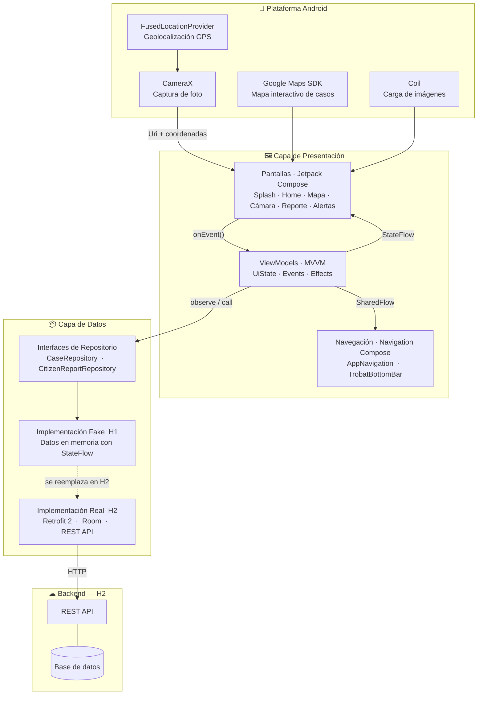
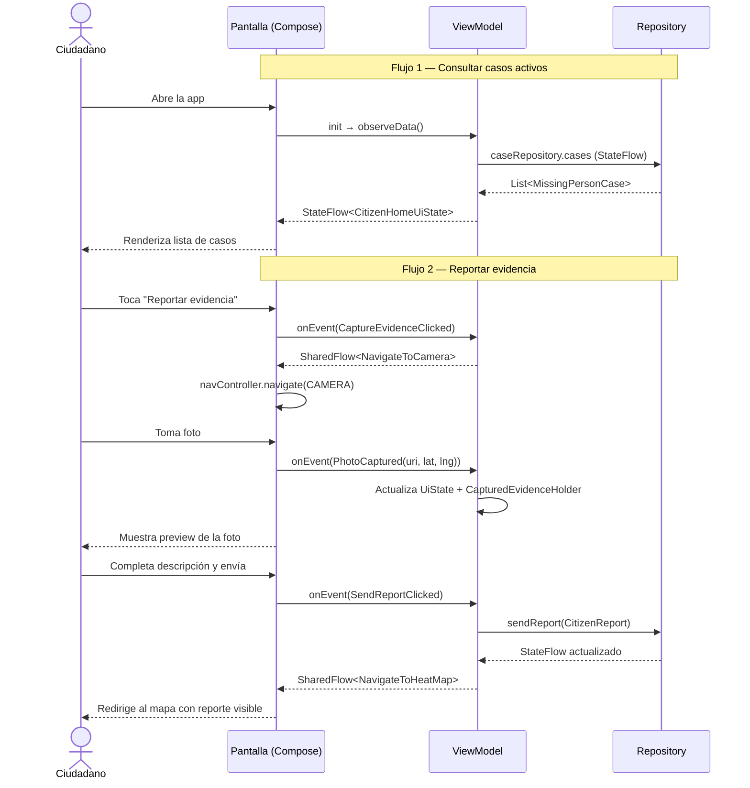

# Trobat

Aplicación Android para la búsqueda colaborativa de personas desaparecidas. Permite a ciudadanos consultar casos activos, reportar evidencia fotográfica geoetiquetada de forma anónima y visualizar zonas con mayor concentración de actividad.

Desarrollado por **Bruno Capriz** y **Franco Verón Peralta**.

---

## Diagrama de arquitectura



---

## Flujo de datos — Patrón MVI



---

## Stack tecnológico

| Capa | Tecnología | Justificación |
|---|---|---|
| Lenguaje | Kotlin | Estándar de la industria Android, null-safety, coroutines nativo |
| UI | Jetpack Compose + Material 3 | UI declarativa, dark mode y dynamic color sin código extra |
| Arquitectura | MVVM + Repository Pattern | Separación de responsabilidades, testeable por capas |
| Estado | Kotlin Coroutines + StateFlow / SharedFlow | Reactivo, lifecycle-aware, diferencia estado persistente de eventos únicos |
| Navegación | Navigation Component (Compose) | Back stack manejado, rutas tipadas |
| Cámara | CameraX | API de alto nivel sobre Camera2, lifecycle-aware |
| Ubicación | FusedLocationProvider (Google Play Services) | Alta precisión, bajo consumo de batería |
| Mapas | Google Maps SDK (Maps Compose) | Integración nativa con markers y cámara programática |
| Imágenes | Coil | Carga asincrónica con caché, compatible con Compose |
| Backend (H2) | REST API + Retrofit 2 + Room | Retrofit para red, Room para persistencia local y modo offline |

---

## Estructura del proyecto

```
app/src/main/java/com/trobat/
├── data/
│   ├── model/          # CitizenReport, MissingPersonCase, CapturedEvidenceHolder
│   └── repository/     # Interfaces + implementaciones Fake (H1) / Real (H2)
└── ui/
    ├── components/     # FloatingCameraButton y componentes reutilizables
    ├── navigation/     # AppNavigation, TrobatBottomBar, rutas
    ├── screen/         # Una pantalla por archivo (Compose)
    ├── theme/          # Color, Type, Shape, Theme (Material 3)
    └── viewmodel/      # Un ViewModel + UiState + Event + Effect por pantalla
```

---

## Cómo buildear

1. Clonar el repositorio
2. Abrir con Android Studio Hedgehog o superior
3. Agregar la API key de Google Maps en `local.properties`:
   ```
   MAPS_API_KEY=tu_api_key
   ```
4. Correr en emulador o dispositivo físico con API 26+

---

## Links

- Figma (flujo de pantallas y design system): _[agregar link_franco]_
- Tablero de seguimiento: _[agregar link_bruno]_
