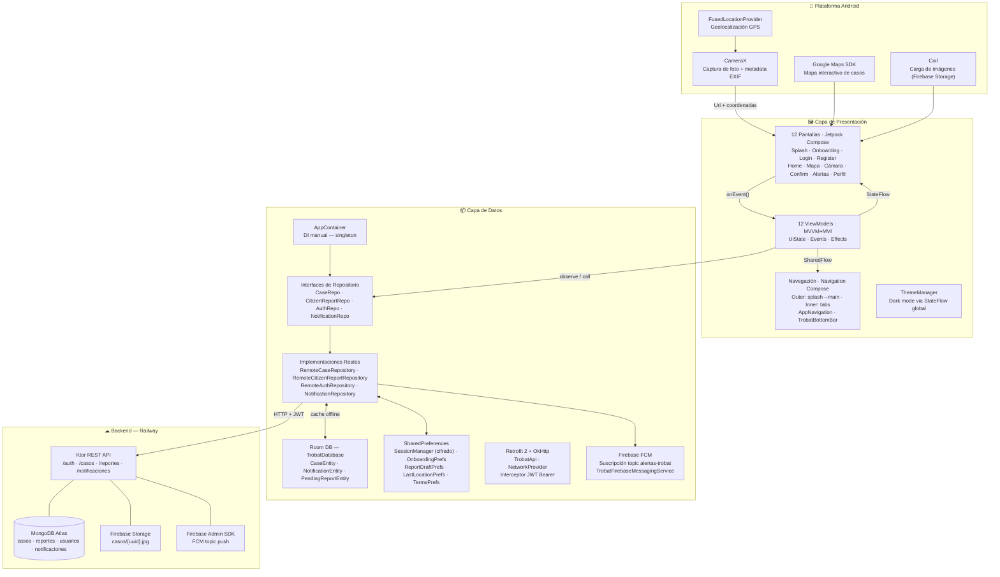
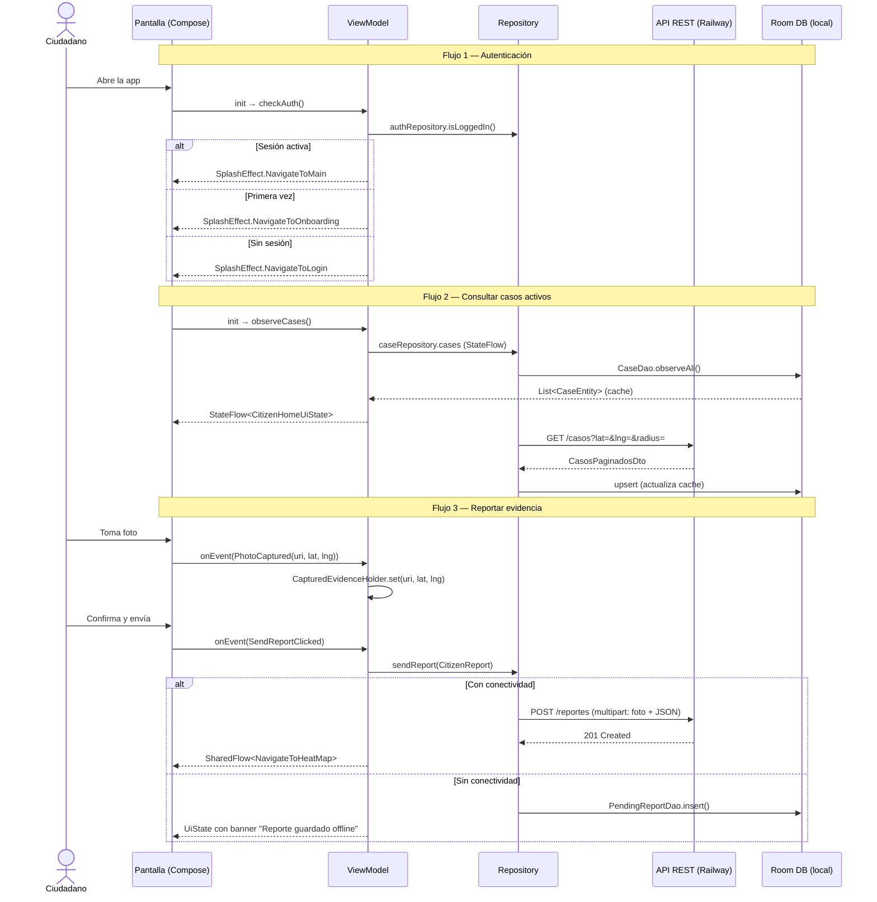

# Trobat

Aplicación Android para la búsqueda colaborativa de personas desaparecidas. Permite a ciudadanos registrarse, consultar casos activos cercanos, reportar evidencia fotográfica geoetiquetada y recibir alertas push en tiempo real desde la plataforma policial.

**Entrega H2 — Sistema completo en producción.**

Desarrollado por **Bruno Capriz** y **Franco Verón Peralta** — UADE Desarrollo de Aplicaciones I · 2026.

---

## Ecosistema

Trobat es un sistema de tres componentes que se comunican vía API REST:

| Componente | Repositorio | Stack | Deploy |
|---|---|---|---|
| App Android (esta repo) | `Trobat/` | Kotlin · Jetpack Compose · MVVM+MVI | APK |
| Backend API | `trobat-api/` | Ktor · MongoDB Atlas · Firebase Admin SDK | Railway |
| Panel web policial | `trobatWeb/` | React · TypeScript · Vite · Zustand | Vercel |

**Backend:** `https://trobatapi-production.up.railway.app`

---

## Arquitectura



---

## Flujo de datos — Patrón MVI



---

## Stack tecnológico

| Capa | Tecnología | Justificación |
|---|---|---|
| Lenguaje | Kotlin | Estándar Android, null-safety, coroutines nativo |
| UI | Jetpack Compose + Material 3 | UI declarativa, dark mode real via ThemeManager |
| Arquitectura | MVVM + MVI | StateFlow estado persistente, SharedFlow efectos únicos |
| DI | AppContainer (manual) | Sin Hilt/Dagger — singleton que provee todas las dependencias |
| Auth | JWT + security-crypto | Token en EncryptedSharedPreferences. Sin exposición de credenciales |
| Persistencia local | Room 2.x (KSP) | 3 entidades: casos (cache), notificaciones, reportes pendientes |
| Red | Retrofit 2 + OkHttp | Interceptor JWT Bearer automático. Multipart para reportes con foto |
| Navegación | Navigation Component (Compose) | Back stack manejado, dos grafos: outer (splash/main) + inner (tabs) |
| Cámara | CameraX | API alto nivel sobre Camera2, lifecycle-aware, galería bloqueada |
| Ubicación | FusedLocationProvider | Alta precisión, bajo consumo de batería |
| Mapas | Google Maps SDK (Maps Compose) | Markers nativos, cámara programática, heatmap de casos |
| Imágenes | Coil | Carga asíncrona con caché, compatible con Compose |
| Push | Firebase FCM | Topic `alertas-trobat`. Canal de alta prioridad en `TrobatApplication` |

---

## Pantallas implementadas (H2)

| Pantalla | ViewModel | Descripción |
|---|---|---|
| SplashScreen | SplashViewModel | Logo animado → decide ruta según auth/onboarding |
| LoadingScreen | — | Estado de carga transitorio |
| OnboardingScreen | CoachmarkController | Tour guiado: Casos → Cámara → Mapa |
| LoginScreen | LoginViewModel | JWT, validación, diálogo de términos y condiciones |
| RegisterScreen | RegisterViewModel | Registro: nombre, email, contraseña, DNI, teléfono |
| CitizenHomeScreen | CitizenHomeViewModel | Card list de casos reales + búsqueda + banner draft |
| CaptureEvidenceScreen | CaptureEvidenceViewModel | CameraX en vivo + GPS + metadata EXIF |
| ConfirmReportScreen | ConfirmReportViewModel | Preview foto + minimap + reverse geocoding + selector de caso |
| HeatMapScreen | HeatMapViewModel | Mapa con casos reales + concentración geográfica |
| NotificationsScreen | NotificationsViewModel | FCM + Room + reportes pendientes mezclados |
| ProfileScreen | ProfileViewModel | Logout, dark mode toggle, toggle notificaciones, datos del usuario |
| TrobatMainScreen | TrobatMainViewModel | Host de tabs + coachmarks + detección de draft pendiente |

---

## Estructura del proyecto

Organización feature-first en la capa UI: cada pantalla agrupa su Screen, ViewModel, UiState, Event y Effect en su propia carpeta.

```
app/src/main/java/com/trobat/
├── MainActivity.kt
├── TrobatApplication.kt
├── TrobatFirebaseMessagingService.kt
│
├── data/
│   ├── DataConstants.kt
│   ├── local/
│   │   ├── db/
│   │   │   ├── dao/            # CaseDao, NotificationDao, PendingReportDao
│   │   │   └── entity/         # CaseEntity, NotificationEntity, PendingReportEntity
│   │   │   └── TrobatDatabase.kt
│   │   └── prefs/              # SessionManager, OnboardingPrefs, ReportDraftPrefs,
│   │                           # LastLocationPrefs, TermsPrefs
│   ├── model/                  # MissingPersonCase, CitizenReport
│   ├── remote/
│   │   ├── NetworkProvider.kt
│   │   ├── TrobatApi.kt
│   │   └── dto/                # AuthDto, CasoDto, ReporteDto
│   └── repository/
│       ├── AppContainer.kt
│       ├── AuthError.kt
│       ├── AuthRepository.kt + RemoteAuthRepository.kt
│       ├── CaseRepository.kt + RemoteCaseRepository.kt + FakeCaseRepository.kt
│       ├── CitizenReportRepository.kt + RemoteCitizenReportRepository.kt + FakeCitizenReportRepository.kt
│       ├── NotificationRepository.kt
│       ├── UserPreferencesRepository.kt
│       └── mapper/             # CasoMapper
│
├── ui/
│   ├── capture/                # CaptureEvidenceScreen + VM + UiState + Event + Effect
│   │                           # + CapturedEvidenceHolder
│   ├── components/             # ActiveCaseCard, CaseDetailSheet, RadiusSlider,
│   │                           # FloatingCameraButton, TermsAndConditionsDialog
│   ├── heatmap/                # HeatMapScreen + VM + UiState + Effect
│   ├── home/                   # CitizenHomeScreen + VM + UiState + Event + Effect
│   ├── login/                  # LoginScreen + VM + UiState + Event + Effect
│   ├── main/                   # TrobatMainScreen + VM + CoachmarkController + CoachmarkOverlay
│   ├── navigation/             # AppNavigation, TrobatBottomBar, MainRoutes,
│   │                           # BottomRoutes, BottomNavigationItems, SplashRoute
│   ├── notifications/          # NotificationsScreen + VM + UiState + Event + PendingReportItem
│   ├── onboarding/             # OnboardingScreen
│   ├── profile/                # ProfileScreen + VM + UiState + Event + Effect
│   ├── register/               # RegisterScreen + VM + UiState + Event + Effect
│   ├── report/                 # ConfirmReportScreen + VM + UiState + Event + Effect
│   ├── splash/                 # SplashScreen + LoadingScreen + VM + UiState + Effect
│   ├── theme/                  # Color, Type, Shape, Theme, ThemeManager
│   └── utils/                  # CameraUtils, LocationUtils, ContextUtils
│
└── utils/                      # ConcentrationUtil, DateUtils, GeoUtils
```

---

## Tests

Suite de **115 tests unitarios** con JUnit4 + MockK + kotlinx-coroutines-test:

```
test/
├── LoginViewModelTest.kt
├── RegisterViewModelTest.kt
├── SplashViewModelTest.kt
├── CaptureEvidenceViewModelTest.kt
├── ConfirmReportViewModelTest.kt
├── NotificationsViewModelTest.kt
├── ProfileViewModelTest.kt
├── ConcentrationUtilTest.kt
├── DateUtilsTest.kt
└── GeoUtilsTest.kt
```

Correr tests:
```bash
./gradlew test
```

---

## Cómo buildear

1. Clonar el repositorio
2. Abrir con Android Studio Hedgehog o superior
3. Agregar en `local.properties`:
   ```
   MAPS_API_KEY=tu_api_key
   ```
4. Correr en emulador o dispositivo físico con API 26+

```bash
./gradlew assembleDebug           # build debug APK
./gradlew test                    # unit tests
./gradlew connectedAndroidTest    # instrumented tests (emulador requerido)
```

---

## Links

- Figma (flujo de pantallas y design system): https://www.figma.com/design/c8Y4VgXszaah9vzOz8LAhx/Trobat?node-id=1001-2&p=f&t=X3ZS3yEfJMH3nEUE-0
- Tablero de seguimiento: https://parallel-music-ae7.notion.site/365c32da677c802aae3ae8c387124d63?v=365c32da677c80ccbde1000c0dbd736b
- Backend en producción: https://trobatapi-production.up.railway.app
- Web Frontend en producción: https://trobat-spa.vercel.app/

(Credenciales del front: juan.perez@policia.gob.ar - policia123)
